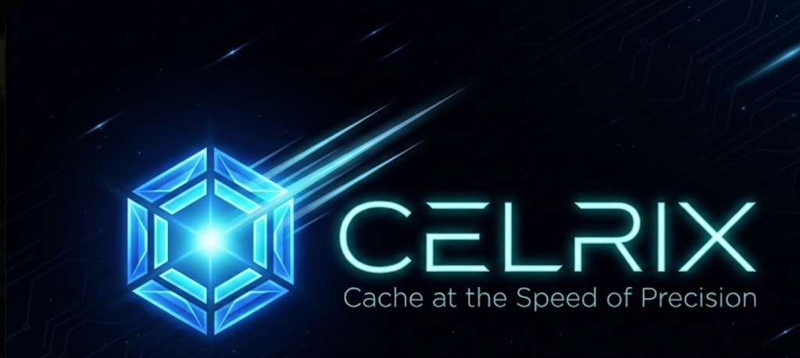

<p align="center">
  
</p>

<p align="center">
  <a href="https://github.com/YASSERRMD/celrix/actions"></a>
  <a href="https://crates.io/crates/celrix"></a>
  <a href="https://github.com/YASSERRMD/celrix/blob/main/LICENSE"></a>
</p>

# CELRIX

**Cache at the Speed of Precision**

CELRIX is a high-performance, in-memory key-value store with native **Vector Similarity Search** capabilities. Built in Rust, it allows you to store standard data alongside high-dimensional embeddings, enabling seamless RAG (Retrieval-Augmented Generation) workflows with microsecond latency.

## 🚀 Key Features

*   **⚡ Extreme Performance**: Engineered with Rust for zero-cost abstractions and predictable memory usage.
*   **🧠 Native Vector Search**: Store and query 1536-dimensional embeddings (compatible with OpenAI) directly alongside your data.
*   **🛣️ Dual Worker Pools**: Innovative architecture separates CPU-intensive Vector operations from I/O-bound KV operations.
    *   *Result*: **5ms** KV latency even while processing heavy vector workloads.
*   **🔌 VCP Binary Protocol**: Custom "Vector Cache Protocol" optimized for minimal overhead.
*   **🌐 Multi-Language Support**: Official clients for **Rust**, **Go**, **TypeScript**, and **Python**.
*   **🛡️ Thread-Safe & Concurrent**: DashMap-backed storage with fine-grained locking and sharding.

## 📊 Performance Benchmark (Phase 11)

Tested on mixed workloads (KV + Vector RAG Cycles):

| Operation | P50 Latency (Isolated) | Throughput |
| :--- | :--- | :--- |
| **Light KV (64B)** | **5.6 ms** | ~2,100 ops/sec |
| **Vector Search** | **117.0 ms** | (Compute Bound) |

*> "The Dual Pool architecture ensures that CPU-heavy vector searches never stall your critical key-value lookups."*

## 🛠️ Installation & Usage

### Docker (Recommended)
```bash
docker pull ghcr.io/yasserrmd/celrix:latest
docker run -p 6380:6380 celrix
```

### Building from Source
```bash
git clone https://github.com/YASSERRMD/celrix.git
cd celrix
cargo build --release
./target/release/celrix-server --port 6380 --kv-workers 8 --vector-workers 4
```

### CLI Arguments
| Flag | Default | Description |
| :--- | :--- | :--- |
| `--port` | 6380 | Server listening port |
| `--kv-workers` | Auto | Threads for SET/GET ops (pinned to cores) |
| `--vector-workers` | 4 | Threads for VADD/VSEARCH (unpinned) |

## 📦 Client SDKs

We provide first-party clients to help you integrate CELRIX into your stack.

### Rust
```rust
use celrix_client::Client;

let mut client = Client::connect("127.0.0.1:6380").await?;
client.set("user:1", "John Doe", None).await?;
client.vadd("user:1:embed", &vector).await?;
let similar = client.vsearch(&query_vector, 5).await?;
```

### Go
```go
client, _ := celrix.NewClient("127.0.0.1:6380")
client.Set("user:1", "Jane Doe", 0)
results, _ := client.VSearch(queryVector, 5)
```

### TypeScript
```typescript
import { CelrixClient } from 'celrix-client';

const client = new CelrixClient({ host: '127.0.0.1', port: 6380 });
await client.set('slogan', 'Cache at the Speed of Precision');
```

## 🏗️ Architecture

CELRIX uses a **Dual-Lane Event Loop**:
1.  **KV Lane**: Powered by a sharded `DashMap` and pinned worker threads. Optimized for `O(1)` access and minimal context switching.
2.  **Vector Lane**: Dedicated pool for computing Cosine Similarity on `Vec<f32>`.

This separation guarantees that your application remains responsive even under heavy AI/ML load.

## 🤝 Contributing

Contributions are welcome! Please ensure you run the stress test suite before submitting a PR.
```bash
cargo test
cargo run --release --example stress
```

## 📄 License

MIT License. See [LICENSE](LICENSE) for details.
